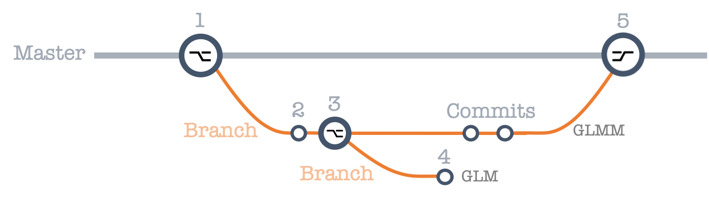

```{r setup, include=FALSE}
knitr::opts_chunk$set(echo = TRUE)
libraries <- c("tidyverse", "shiny", "excelR", "readxl", "knitr")
lapply(libraries, library, character.only = TRUE)
```

# Git and GitHub
In this lesson we covered Git, GitHub, and their integration into RStudio for the purpose of sharing and copying publicly-available code. 


```{r, out.width = "900px", echo=FALSE, fig.cap= "_Fig. 1: GitHub logo_"}

```

GitHub is an online repository (i.e. a storage space) which facilitates the storage and sharing of code. GitHub is the front end of Git, which is the underlying code which does all of the work. GitHub is just a user-friendly interface.  

GitHub can be integrated into RStudio. This means you can store your data in your online repository seamlessly.   


# Repository Structure
Common components of a repository:


* A folder which contains code
* A folder which contains data
* A README.md file
    + These files describe the contents of the repository.
    + They should give details about the data, methods, links to publicatins supported by the repository, the authors of the code, the owners of the data, etc.
    
Repository files which have been updated can be saved via the "commit" function in the Git tab in the workspace/history pane. This pane also includes information on whether any files in the repository have been modified. To send the saved files to your repository, you have to use the "push" function in the Git tab.


# R Markdown
R Markdown is a format for writing reproducible, dynamic reports with R. It can be used to embed R code and results into slideshows, pdfs, html documents, Word files and more. An R Markdown file is a plain text file that has the extension `.Rmd`.  

Perhaps the most useful thing about RMarkdown is its ability to include R code into the document. This code can either be run invisibly in the background or can be run and shown in the document itself. The important thing to realise is there is effectively an R script BEHIND the RMarkdown script, and that using the  ` ``` {r}` &`  ``` ` commands (aka chunk delimiters) just allows you to access this script that is there in the background.  

Each R chunk is not treated as a seperate mini script, rather it can use objects made by previous chunks, and can be used by upcoming chunks. This means you can include complex R code into RMarkdown files which can run in the background to produce graphics, simulations, etc.  

Here are some examples:  

```{r echo=FALSE, results='asis'}
kable(mtcars[1:5, ], caption = "_Fig. 2: A Knitr Table_")
```

```{r echo=FALSE, fig.cap="_Fig. 3: Graphical Result_"}
plot(pressure)
```


# Branching and Version Control
Branching and version control are not the same thing.

## Branching
A branch represents an independent line of development. Branches serve as an abstraction for the edit/stage/commit process. When you make a Github repository you create the Master branch - this is the main working branch of the repository. You can make and commit changes to this master branch as we did above.  

```{r, out.width = "300px", echo=FALSE, fig.cap= "_Fig.4: GitHub profile branch details._"}
knitr::include_graphics("images/branching.png")
```

Branching is a way of having multiple parallel repositories which you can work on independently, and then merge the changes back together to form a single repository again. 

```{r, out.width = "600px", echo=FALSE, fig.cap= "_Fig.5: Branching explained._"}

```


## Version Control
Version control is the ability to move back to an earlier version of our repository. You can move back to a point on the current branch you are working on or to a different branch altogether. In summary, you can move back to any point at which you made a `commit`. This is why it's important to `commit` selectively. 

# Functions

Key functions from the lesson:

Call                              | Function
--------------------------------- | -----------------
rm(list = ls())                   |Clear R's memory
rnorm()                           |Random numbers from a uniform distribution
install.package("package name")   |Install package 
library("package name")           |Load installed packages

