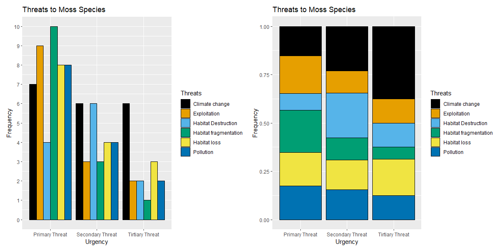
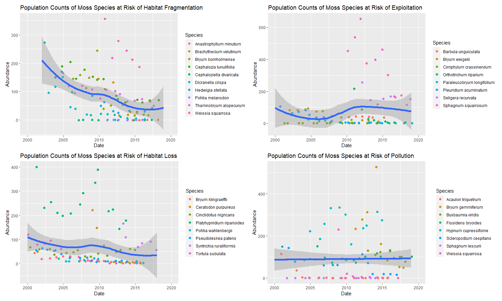

```{r setup, include=FALSE}

knitr::opts_chunk$set(echo = TRUE)
libraries <- c("tidyverse", "shiny", "excelR", "readxl", "knitr", "vroom", "lubridate", "devtools", "patchwork", "ggthemes")
lapply(libraries, library, character.only = TRUE)

```

## Summary of Task

The goal of the homework for this week is to play around with the data from Week 3. These data detail the various threats to moss species, as well as population counts of multiple species over time. 

Here's an example:
``` {r include=FALSE}

tsp1 <- vroom("https://raw.githubusercontent.com/chrit88/Bioinformatics_data/master/Workshop%203/to_sort_pop_1.csv")

tsp2 <- vroom("https://raw.githubusercontent.com/chrit88/Bioinformatics_data/master/Workshop%203/to_sort_pop_2.csv")

tsp_joined <- full_join(tsp1, tsp2)

tsp_long <- tsp_joined %>%
  
  pivot_longer(cols = -c(species:tertiary_threat),
               names_to = c("population", "date"),
               values_to = "abundance",
               values_drop_na = F, 
               names_pattern = "pop_(1|2)_(.*)")

```

``` {r echo=FALSE, results= 'asis'}

knitr::kable(head(tsp_long), caption = "_Fig. 1. SUmmary of data from Week 3 homework._")


```

## Data Wrangling and Analysis

I wanted to look specifically at the species which were under threat. To do so I first filtered the data so as to list each species and their corresponding threats. 

``` {r include=TRUE}

## First we're going to make sure that the values in the date column are recognized as dates. Tell lubridate 
## what the current format is - month, day, year (this will be relevant later on).

tsp_long$date <- ymd(tsp_long$date)

## then convert it so it is only the year (day and month are redundant)

tsp_long$date <- year(tsp_long$date)

## removing the date and abundance columns and removing duplicate rows so we have one of each threat per species

threats_only <- tsp_long %>%
  select(species:tertiary_threat) %>%
  distinct()

```

``` {r echo=FALSE, results= 'asis'}

knitr::kable(head(threats_only), caption = "_Fig. 2. Summary of data from Week 3 homework._")


```

Next I wanted to summarize the frequency of each threat as it appears as a primary, secondary, or tertiary threat. I did this by making three separate tables (one for each level of "urgency" - i.e. primary, secondary etc). I then made one master table containing all 3 levels and the frequency they all appear.

``` {r include=TRUE}

#creating a data frame for each threat level

pthreat <-  table(threats_only$primary_threat)%>%
  as.data.frame()

names(pthreat)[2] = "freq_primary"

sthreat <-  table(threats_only$secondary_threat)%>%
  as.data.frame()

names(sthreat)[2] = "freq_secondary"

tthreat <-  table(threats_only$tertiary_threat)%>%
  as.data.frame()

names(tthreat)[2] = "freq_tertiary"

all_threats <- full_join(pthreat, sthreat, by="Var1") %>%
  full_join(tthreat, by="Var1")

names(all_threats)[2:4] <- c("Primary_Threat", "Secondary_Threat", "Tertiary_Threat")
names(all_threats)[1] <- "Threat"

```

``` {r echo=FALSE, results= 'asis'}

knitr::kable(head(all_threats), caption = "_Fig. 3. Frequency of each threat for each level of urgency._")

```

I wanted to graph these frequencies to show the breakdown of each threat. To do so, I wrangled the data so that each level of urgency was on the left side and each threat was a variable (column). 

``` {r echo=TRUE}

## transpose the data frame

tst1 <- all_threats %>%
  t() %>%
  as_tibble() 

colnames(tst1) <- slice(tst1, 1)
tst2 <- tst1[-c(1),]

 
tst2$Threats <- c("primary_threat", "secondary_threat", "tertiary_threat")
tst3 <- relocate(tst2, Threats)

```

``` {r echo=FALSE, results= 'asis'}

knitr::kable(tst3, caption = "_Fig. 4. Wide format table._")

```

To start plotting, I had to convert to a long format. 

``` {r echo=TRUE}

Urgency <- rep(c("primary_threat", "secondary_threat", "tertiary_threat"), each=6)
Threats <- rep(c("Climate change", "Exploitation", "Habitat Destruction", "Habitat fragmentation", "Habitat loss", "Pollution"), 3)

plotting_df <- data.frame(Urgency, Threats)

## taking the frequency values from tst2 

d <- c(slice(tst1, 2), slice(tst1, 3), slice(tst1, 4))
d <- unlist(d)

plotting_df$Frequency <- d

plotting_df <- as_tibble(plotting_df)
plotting_df$Frequency <- as.numeric(plotting_df$Frequency)

```

``` {r echo=FALSE, results= 'asis'}

knitr::kable(plotting_df, caption = "_Fig. 5. Long format table._")

```

## Plotting Threat Frequency

```{r echo=TRUE}
## adding colour blind-friendly palettes

cbbPalette <- c("#000000", "#E69F00", "#56B4E9", "#009E73", "#F0E442", "#0072B2", "#D55E00", "#CC79A7")

## non-stacked chart

plot1 <- ggplot(data = plotting_df, aes(x = Urgency, y = Frequency, fill = Threats)) +
  geom_bar(aes(y = Frequency), position="dodge", stat="identity", colour = "black") +
  scale_y_continuous(breaks=seq(0, 10, 1)) +
  labs(title = "Threats to Moss Species") +
  scale_fill_manual(values=cbbPalette) +
  scale_x_discrete(labels = c("Primary Threat", "Secondary Threat", "Tirtiary Threat"))

## stacked chart

plot2 <- ggplot(data = plotting_df, aes(x = Urgency, y = Frequency, fill = Threats)) +
  geom_bar(aes(y = Frequency), position="fill", stat="identity", colour = "black") +
  labs(title = "Threats to Moss Species") +
  scale_fill_manual(values=cbbPalette) +
  scale_x_discrete(labels = c("Primary Threat", "Secondary Threat", "Tirtiary Threat"))
```

``` {r echo=FALSE, fig.cap= "_Fig. 6: Breakdown of threats to moss species and their relative frequency._"}



```

## Data Wrangling and Plotting for Abundance Data

These graphs show that the most common primary threat to moss species are habitat fragmentation, exploitation, habitat loss, and pollution. 

Because of this, I wanted to look at the abundance of the moss species over time which have these factors listed as primary threats.
To do this, I filtered out any rows which didn't have any value (NA) for abundance. After this, I removed any species listed which didn't have any values for "primary threat" as it was assumed that they weren't endangered. 

``` {r echo=TRUE}
## removing the rows which have no values for abundance

tsp_nona <- tsp_long %>%
  drop_na(abundance)

## removing the species which aren't endangered

tsp_endangered <- tsp_nona %>%
  drop_na(primary_threat)
```


``` {r echo=TRUE}
## Want to look at species which are primarily under threat due to habitat frag as it's the biggest 

hf <- tsp_endangered %>%
  filter(primary_threat == "Habitat fragmentation")

hf_plot <- ggplot(data = hf, aes(x = date, y = abundance)) + 
  geom_jitter(aes(col = species), size = 2) +
  geom_smooth(size = 2) +
  xlab("Date") + ylab("Abundance") +
  labs(title = "Population Counts of Moss Species at Risk of Habitat Fragmentation", fill = "Species") +
  scale_colour_discrete(name = "Species")


## Want to look at species which are primarily under threat due to exploitation as it's the second biggest 

ex <- tsp_endangered %>%
  filter(primary_threat == "Exploitation" ) 

ex <- slice(ex, 1:97)

ex_plot <- ggplot(data = ex, aes(x = date, y = abundance)) + 
  geom_jitter(aes(col = species), size = 2) +
  geom_smooth(size = 2) +
  xlab("Date") + ylab("Abundance") +
  labs(title = "Population Counts of Moss Species at Risk of Exploitation", fill = "Species") +
  scale_colour_discrete(name = "Species")

  
## Want to look at species which are primarily under threat due to Habitat loss as it's the third biggest 

hl <- tsp_endangered %>%
  filter(primary_threat == "Habitat loss" ) 

hl_plot <- ggplot(data = hl, aes(x = date, y = abundance)) + 
  geom_jitter(aes(col = species), size = 2) +
  geom_smooth(size = 2) +
  xlab("Date") + ylab("Abundance") +
  labs(title = "Population Counts of Moss Species at Risk of Habitat Loss", fill = "Species") +
  scale_colour_discrete(name = "Species")

## Want to look at species which are primarily under threat due to Pollution as it's the fourth biggest 

pol <- tsp_endangered %>%
  filter(primary_threat == "Pollution" ) 

pol_plot <- ggplot(data = pol, aes(x = date, y = abundance)) + 
  geom_jitter(aes(col = species), size = 2) +
  geom_smooth(method = "lm") +
  xlab("Date") + ylab("Abundance") +
  labs(title = "Population Counts of Moss Species at Risk of Pollution", fill = "Species") +
  scale_colour_discrete(name = "Species")

## all graphs were stitched together using the patchwork package from thomasp85
```

``` {r echo=FALSE, fig.cap= "_Fig. 7: Breakdown of threats to moss species and their relative frequency._"}



```

## Data Interpretation 

These data suggest that moss species primarily at risk of habitat fragmentation and habitat loss are, on average, actively declining in population size. Species primarily at risk of exploitation and pollution don't appear to be declining on average. This disparity may be as a result of the more immediate effects of habitat loss and fragmentation. There are also a number of limitations to these results:

1.    Abundance counts for all species is not consistent. There is more data available regarding the abundance of some species compared to others.
2.    Some data were not available for some species. This includes population counts, as well as information on threat susceptibility (those with no threats listed were assumed to not be at risk). 
3.    I only looked at the top 4 primary threats, there may also be iteresting trends for the remaining threats and at difference urgency levels.
4.    Data was admittedly cherry-picked out of convenience and time (sorry!).

