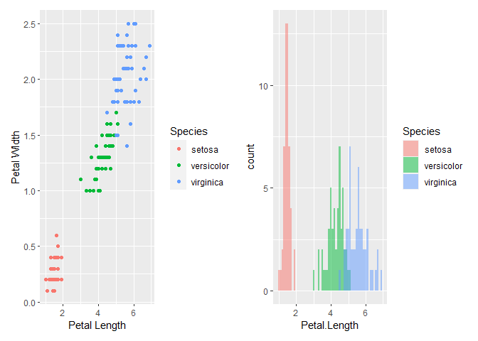

Week 6 Homework
================

# Homework Part 1 - Tokyo Olympics

For the first part of today’s homework, I’ll be looking at whether there
is any significant effect of a country’s GDP on their position in the
Tokyo Olympics medal table. The data used was obtained from GitHub user
`chrit88`
[here](%22https://github.com/chrit88/Bioinformatics_data/tree/master/Workshop%205%22).

## Task 1

Find out how to get GDP for the countries. Firstly, let’s import the
dataset.

``` r
tokyo <- vroom("https://raw.githubusercontent.com/chrit88/Bioinformatics_data/master/Workshop%205/Tokyo%202021%20medals.csv")
```

    ## Rows: 89 Columns: 4

    ## -- Column specification --------------------------------------------------------
    ## Delimiter: ","
    ## chr (1): Country
    ## dbl (3): Gold, Silver, Bronze

    ## 
    ## i Use `spec()` to retrieve the full column specification for this data.
    ## i Specify the column types or set `show_col_types = FALSE` to quiet this message.

``` r
## adding country codes

tokyo$code <- countrycode(tokyo$Country,
  origin = "country.name",
  destination = "iso3c")
```

    ## Warning in countrycode_convert(sourcevar = sourcevar, origin = origin, destination = dest, : Some values were not matched unambiguously: Kosovo

``` r
## manually adding China

tokyo$code[2] <- "CHN"

head(tokyo)
```

    ## # A tibble: 6 x 5
    ##   Country            Gold Silver Bronze code 
    ##   <chr>             <dbl>  <dbl>  <dbl> <chr>
    ## 1 United States        39     41     33 USA  
    ## 2 Republic of China    38     32     18 CHN  
    ## 3 Japan                27     14     17 JPN  
    ## 4 Great Britain        22     21     22 GBR  
    ## 5 Russia               20     28     23 RUS  
    ## 6 Australia            17      7     22 AUS

The World Bank provides data on GDP which can be accessed through the
wbstats package. Let’s get this data and filter to include the latest
data (2020).

``` r
gdp <-  wb_data("NY.GDP.MKTP.CD")

gdp <- gdp %>%
  filter(date == "2020") %>%
  rename("code" = "iso3c", "gdp" = "NY.GDP.MKTP.CD")
```

## Task 2

Now that the data is loaded in, let’s merge the tables together based on
the country code.

``` r
tokyo_gdp <- left_join(tokyo, gdp, by="code")

head(tokyo_gdp)
```

    ## # A tibble: 6 x 13
    ##   Country  Gold Silver Bronze code  iso2c country  date     gdp unit  obs_status
    ##   <chr>   <dbl>  <dbl>  <dbl> <chr> <chr> <chr>   <dbl>   <dbl> <chr> <chr>     
    ## 1 United~    39     41     33 USA   US    United~  2020 2.09e13 <NA>  <NA>      
    ## 2 Republ~    38     32     18 CHN   CN    China    2020 1.47e13 <NA>  <NA>      
    ## 3 Japan      27     14     17 JPN   JP    Japan    2020 4.98e12 <NA>  <NA>      
    ## 4 Great ~    22     21     22 GBR   GB    United~  2020 2.71e12 <NA>  <NA>      
    ## 5 Russia     20     28     23 RUS   RU    Russia~  2020 1.48e12 <NA>  <NA>      
    ## 6 Austra~    17      7     22 AUS   AU    Austra~  2020 1.33e12 <NA>  <NA>      
    ## # ... with 2 more variables: footnote <chr>, last_updated <date>

China was manually changed as it was recognized as Taiwan in the Olympic
Table.

In order to compare GDP to position in the table, we’re going to make a
column which contains the indexes of the rows.

``` r
tokyo_gdp$position <- as.numeric(rownames(tokyo_gdp))

## remove rows that GDP couldn't be obtained for

tokyo_gdp <- tokyo_gdp %>%
  filter(!is.na(gdp))
```

## Task 3

We now want to visualise the relationship between GDP and position in
the table.

``` r
p1.1 <- ggplot(tokyo_gdp, aes(x =gdp, y = position)) +
  geom_point() +
  ggtitle("Relationship between GDP and Position in the Olympic Table") +
  theme_bw() +
  scale_y_reverse(breaks = c(1, 10, 20, 30, 40, 50, 60, 70, 80, 90)) +
  scale_x_reverse() 

## Makeing a plot using the log scale

p1.2 <- ggplot(tokyo_gdp, aes(x =log(gdp), y = position)) +
  geom_point() +
  ggtitle("Relationship between log(GDP) and Position in the Olympic Table") +
  theme_bw() +
  scale_y_reverse(breaks = c(1, 10, 20, 30, 40, 50, 60, 70, 80, 90)) +
  scale_x_reverse() 

p1.1 + p1.2
```

<!-- -->

## Task 4

Fit an appropriate GLM to the data and check its assumptions.

``` r
#===================================================
#         MOD1
#===================================================
mod1 <- glm(position ~ log(gdp),
            data = tokyo_gdp,
            family = "gaussian")

tokyo_gdp$pred_gaussian <- predict(mod1,
                                    type="response")

tokyo_gdp$resid_gaussian <- resid(mod1)

##Checking the distribution of the residuals to see if they fit the normal distribution

plot_mod1 <- ggplot(tokyo_gdp, aes(x = resid_gaussian)) +
  geom_histogram() +
  theme_minimal() +
  ggtitle("Histogram of residuals (gaussian with identity link)")

plot_mod1
```

    ## `stat_bin()` using `bins = 30`. Pick better value with `binwidth`.

<!-- -->

``` r
#===================================================
#         MOD2
#===================================================

mod2 <- glm(position ~ gdp,
            data = tokyo_gdp,
            family = gaussian(link = "log"))

tokyo_gdp$pred_gaussian_log <- predict(mod2,
                                    type="response")

tokyo_gdp$resid_gaussian_log <- resid(mod2)

##Checking the distribution of the residuals to see if they fit the normal distribution

plot_mod2 <- ggplot(tokyo_gdp, aes(x = resid_gaussian_log)) +
  geom_histogram() +
  theme_minimal() +
  ggtitle("Histogram of residuals (gaussian with log link)")

plot_mod2
```

    ## `stat_bin()` using `bins = 30`. Pick better value with `binwidth`.

<!-- -->

``` r
##compare the models
AIC_mods <- AIC(mod1,
                mod2)

## rank them by AIC using the order() function
AIC_mods[order(AIC_mods$AIC),]
```

    ##      df      AIC
    ## mod2  3 719.1183
    ## mod1  3 720.7458

According to the AIC criterion, there appears to be no significant
difference between the two models. The residuals all appear to follow a
normal distribution.

Lets graph the two models.

``` r
#===========================
#     Plot for Model 1
#===========================


p2 <- ggplot(tokyo_gdp, aes(x = log(gdp), y = position)) +
  geom_point() +
  geom_line() +
  theme_bw() +
  ylab("Position") +
  xlab("Log GDP") +
  scale_y_reverse(breaks = c(1, 10, 20, 30, 40, 50, 60, 70, 80, 90)) +
  scale_x_reverse() 

##add in a line of the predicted values from the model
p2 <- p2 + geom_smooth(data=tokyo_gdp,
                       method="glm",
                       method.args = list(family = "gaussian"),
                       formula = y ~ x,
                       col = "dodgerblue",
                       fill = "lightblue")

p2 <- p2 +geom_segment(aes(xend= log(gdp), yend = pred_gaussian),
                       col = "red")

## add a title
p2 <- p2 + ggtitle("Fitted Model (Gaussian with Ddentity Link)")


#===========================
#     Plot for Model 2
#===========================


p3 <- ggplot(tokyo_gdp, aes(x = gdp, y = position)) +
  geom_point()+
  ylab("Position") +
  xlab("GDP") 

p3 <- p3 + geom_smooth(data=tokyo_gdp,
                       method="glm",
                       method.args = list(family = gaussian(link="log")),
                       formula = y ~ x,
                       col = "dodgerblue",
                       fill = "lightblue") +
                        ggtitle("Fitted Model (With Log Link)") 

## Comparing the two

p2 + p3
```

<!-- -->

``` r
summary(mod1)
```

    ## 
    ## Call:
    ## glm(formula = position ~ log(gdp), family = "gaussian", data = tokyo_gdp)
    ## 
    ## Deviance Residuals: 
    ##    Min      1Q  Median      3Q     Max  
    ## -43.62  -16.03   -2.09   11.89   48.02  
    ## 
    ## Coefficients:
    ##             Estimate Std. Error t value Pr(>|t|)    
    ## (Intercept)  243.766     33.208   7.341 1.76e-10 ***
    ## log(gdp)      -7.716      1.276  -6.046 4.80e-08 ***
    ## ---
    ## Signif. codes:  0 '***' 0.001 '**' 0.01 '*' 0.05 '.' 0.1 ' ' 1
    ## 
    ## (Dispersion parameter for gaussian family taken to be 455.6676)
    ## 
    ##     Null deviance: 52200  on 79  degrees of freedom
    ## Residual deviance: 35542  on 78  degrees of freedom
    ## AIC: 720.75
    ## 
    ## Number of Fisher Scoring iterations: 2

``` r
summary(mod2)
```

    ## 
    ## Call:
    ## glm(formula = position ~ gdp, family = gaussian(link = "log"), 
    ##     data = tokyo_gdp)
    ## 
    ## Deviance Residuals: 
    ##     Min       1Q   Median       3Q      Max  
    ## -38.556  -16.008   -0.267   16.401   51.450  
    ## 
    ## Coefficients:
    ##               Estimate Std. Error t value Pr(>|t|)    
    ## (Intercept)  4.030e+00  6.193e-02  65.083  < 2e-16 ***
    ## gdp         -6.038e-13  1.691e-13  -3.571 0.000613 ***
    ## ---
    ## Signif. codes:  0 '***' 0.001 '**' 0.01 '*' 0.05 '.' 0.1 ' ' 1
    ## 
    ## (Dispersion parameter for gaussian family taken to be 446.5054)
    ## 
    ##     Null deviance: 52200  on 79  degrees of freedom
    ## Residual deviance: 34826  on 78  degrees of freedom
    ## AIC: 719.12
    ## 
    ## Number of Fisher Scoring iterations: 7

Looking at the summary tables and plots, it looks like there is a
significant relationship between GDP and log(GDP) against position on
the Olympic Table. Both relationships show that there is a negative
relationship between the two, so as you decrease GDP there is a
corresponding decrease in your position on the table.

------------------------------------------------------------------------

# Homework Part 2 - Iris with Multiple Predictors

## Task 1

Load in the Iris data and visualize the relationship between petal
length and petal width.

``` r
## visualize the data

irplot <- ggplot(data = iris, aes(x= Petal.Length, y=Petal.Width, col=Species)) +
  geom_point() +
  xlab("Petal Length") +
  ylab("Petal WIdth") 


## see if data conforms to gaussian

gaus_plot <- ggplot(iris, aes(x=Petal.Length, fill=Species)) +
  geom_histogram(binwidth=.1, alpha=.5, position="identity")

irplot + gaus_plot
```

<!-- -->

## Tasks 2 - 5

The data appears to have a strong positive relationship between the
independent and dependent variables. The data also conforms to the
normal distribution. Because of this, I’m going to use a GLM and assume
the residuals follow a normal distribution.

``` r
#==========================================
#       MOD1
#==========================================

## make a model

irmod1 <- glm(Petal.Width ~ Petal.Length,
            data = iris,
            family = "gaussian")

## calculate the residuals

iris$pred_gaussian <- predict(irmod1,
                                   type="response")

iris$resid_gaussian <- resid(irmod1)


## plot the residuals

resid_plot1 <- ggplot(iris, aes(x = resid_gaussian)) +
  geom_histogram(fill="goldenrod") +
  theme_minimal() +
  ggtitle("Histogram of residuals")

## plot the model

irplot1 <- irplot + geom_smooth(data=iris,
                       method="glm",
                       method.args = list(family = "gaussian"),
                       formula = y ~ x,
                       col = "dodgerblue",
                       fill = "lightblue")
irplot1
```

<!-- -->

``` r
summary(irmod1)
```

    ## 
    ## Call:
    ## glm(formula = Petal.Width ~ Petal.Length, family = "gaussian", 
    ##     data = iris)
    ## 
    ## Deviance Residuals: 
    ##      Min        1Q    Median        3Q       Max  
    ## -0.56515  -0.12358  -0.01898   0.13288   0.64272  
    ## 
    ## Coefficients:
    ##               Estimate Std. Error t value Pr(>|t|)    
    ## (Intercept)  -0.363076   0.039762  -9.131  4.7e-16 ***
    ## Petal.Length  0.415755   0.009582  43.387  < 2e-16 ***
    ## ---
    ## Signif. codes:  0 '***' 0.001 '**' 0.01 '*' 0.05 '.' 0.1 ' ' 1
    ## 
    ## (Dispersion parameter for gaussian family taken to be 0.04263579)
    ## 
    ##     Null deviance: 86.5699  on 149  degrees of freedom
    ## Residual deviance:  6.3101  on 148  degrees of freedom
    ## AIC: -43.591
    ## 
    ## Number of Fisher Scoring iterations: 2

This model appears to fit well. The residuals follow a normal
distribution, the diagnostic plots don’t raise any flags, and there is a
strong relationship between the two variables.

## Task 6

Now lets see if the effect of petal length on petal width varies across
the different species.

``` r
irmod2 <- glm(Petal.Width ~ Petal.Length*Species,
            data = iris,
            family = "gaussian")

irmod3 <- glm(Petal.Width ~ Petal.Length*Species,
            data = iris,
            family = gaussian(link = "inverse"))


##compare the models
AIC_mods <- AIC(irmod2,
                irmod3)

## rank them by AIC using the order() function
AIC_mods[order(AIC_mods$AIC),]
```

    ##        df       AIC
    ## irmod2  7 -85.39086
    ## irmod3  7 -85.17236

``` r
## plotting three different lines

iris_split <- ggplot(iris, aes(x=Petal.Length, y=Petal.Width, col=Species)) +
  geom_point() +
  geom_smooth(method = "glm",
              method.args = list(family = "gaussian"))

iris_split
```

    ## `geom_smooth()` using formula 'y ~ x'

<!-- -->

``` r
summary(irmod2)
```

    ## 
    ## Call:
    ## glm(formula = Petal.Width ~ Petal.Length * Species, family = "gaussian", 
    ##     data = iris)
    ## 
    ## Deviance Residuals: 
    ##     Min       1Q   Median       3Q      Max  
    ## -0.6337  -0.0744  -0.0134   0.0866   0.4503  
    ## 
    ## Coefficients:
    ##                                Estimate Std. Error t value Pr(>|t|)    
    ## (Intercept)                    -0.04822    0.21472  -0.225 0.822627    
    ## Petal.Length                    0.20125    0.14586   1.380 0.169813    
    ## Speciesversicolor              -0.03607    0.31538  -0.114 0.909109    
    ## Speciesvirginica                1.18425    0.33417   3.544 0.000532 ***
    ## Petal.Length:Speciesversicolor  0.12981    0.15550   0.835 0.405230    
    ## Petal.Length:Speciesvirginica  -0.04095    0.15291  -0.268 0.789244    
    ## ---
    ## Signif. codes:  0 '***' 0.001 '**' 0.01 '*' 0.05 '.' 0.1 ' ' 1
    ## 
    ## (Dispersion parameter for gaussian family taken to be 0.03144043)
    ## 
    ##     Null deviance: 86.5699  on 149  degrees of freedom
    ## Residual deviance:  4.5274  on 144  degrees of freedom
    ## AIC: -85.391
    ## 
    ## Number of Fisher Scoring iterations: 2
