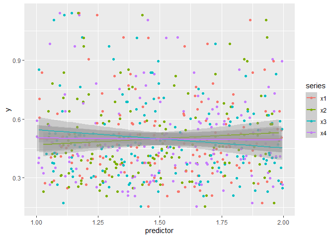
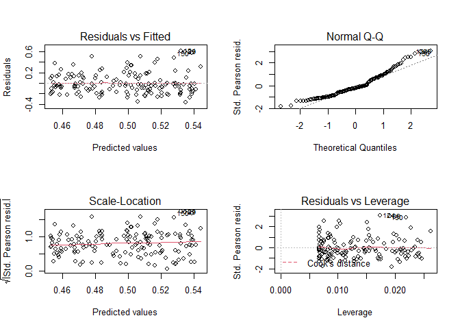
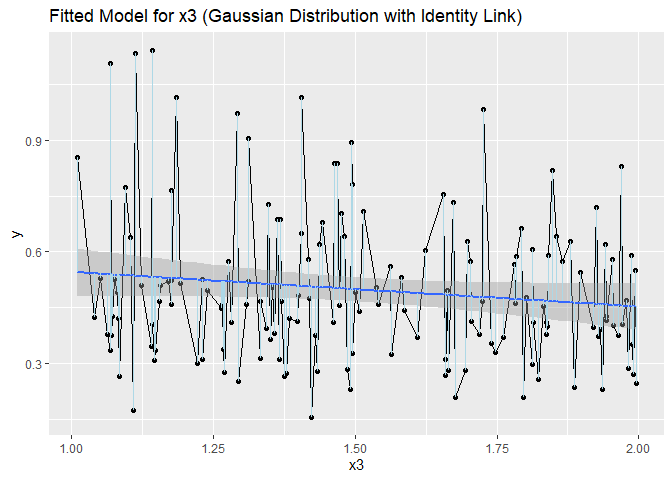
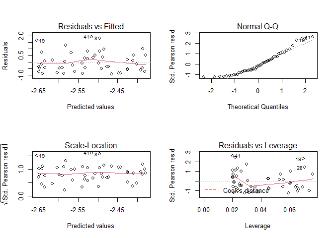
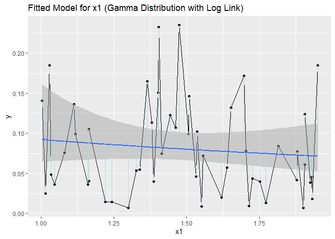
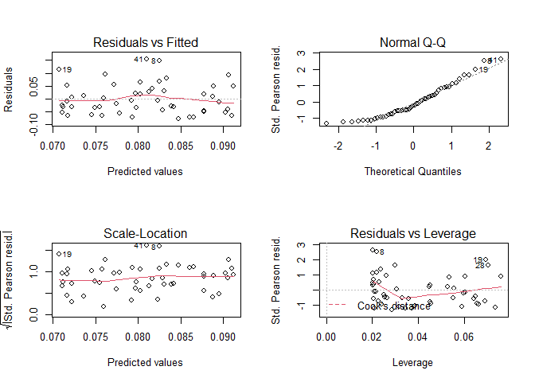
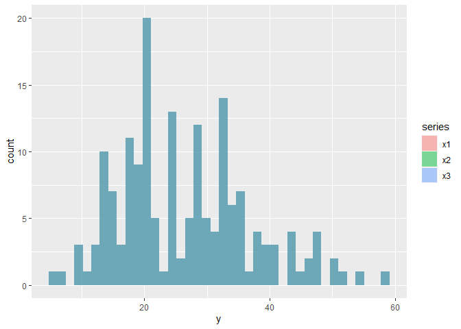
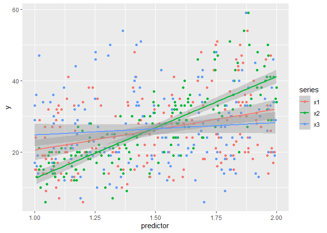
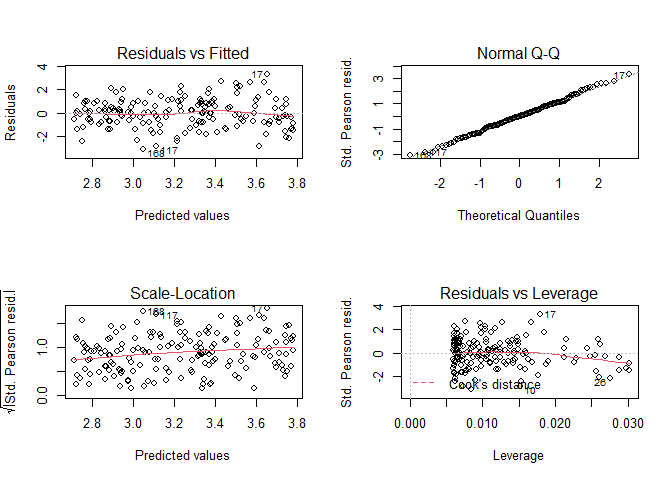
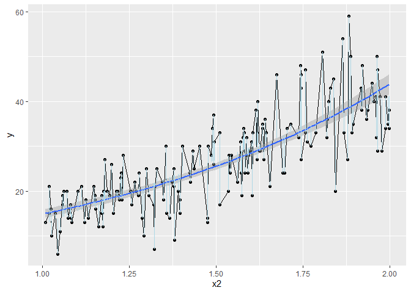

Week 7 Homework
================

# Dataset 1

Loading in the data and visualizing it. I’m going to overlay some simple
linear regressions to see if there are any observable trends.

``` r
data1 <- vroom("https://raw.githubusercontent.com/chrit88/Bioinformatics_data/master/Workshop%206/data%201.csv")
```

    ## Rows: 150 Columns: 5

    ## -- Column specification --------------------------------------------------------
    ## Delimiter: ","
    ## dbl (5): y, x1, x2, x3, x4

    ## 
    ## i Use `spec()` to retrieve the full column specification for this data.
    ## i Specify the column types or set `show_col_types = FALSE` to quiet this message.

``` r
## converting table to long format for easier plotting 

df1_long <- data1 %>%
  pivot_longer(x1:x4, names_to = "series", values_to = "predictor" )

## plotting all variables and adding in a simple linear regression line to visualize any possible effects between 
## different predictors

df1_plot <- ggplot(data = df1_long, aes(x = predictor, y = y)) +
  geom_point(aes(col = series)) +
  geom_smooth(aes(col = series),
              method="glm",
              method.args = list(family = "gaussian"),
              formula = y ~ x,)

df1_plot
```

<!-- -->

There is no obviously apparent trend in any of the data series’. All
points look randomly distributed. Next I’m going to look at the
distribution of the data.

``` r
df1_dist <- ggplot(df1_long, aes(x = y, fill = series)) +
  geom_histogram(alpha = 0.5, position = "identity")
```

The data from each predictor variable appears to follow the normal
distribution, and is slightly skewed to the right. I’m going to try
fitting some models to the data. Because it is non-integer data, I will
try to fit using a Gaussian error distribution.

``` r
df1_mod1 <- glm(y ~ x1, 
                data = data1,
                family = "gaussian")

df1_mod2 <- glm(y ~ x2, 
                data = data1,
                family = "gaussian")

df1_mod3 <- glm(y ~ x3, 
                data = data1,
                family = "gaussian")

df1_mod4 <- glm(y ~ x4, 
                data = data1,
                family = "gaussian")

## Testing alternative links

df1_mod5 <- update(df1_mod1, family = gaussian(link = "inverse"))
df1_mod6 <- update(df1_mod2, family = gaussian(link = "inverse"))
df1_mod7 <- update(df1_mod3, family = gaussian(link = "inverse"))
df1_mod8 <- update(df1_mod4, family = gaussian(link = "inverse"))

## Comparing the fits of the models

AIC_mods <- data.frame(model = c("df1_mod1", "df1_mod2", "df1_mod3", "df1_mod4", "df1_mod5", "df1_mod6", "df1_mod7", "df1_mod8"),
                       AICc = c(AICc(df1_mod1), AICc(df1_mod2), AICc(df1_mod3), AICc(df1_mod4), AICc(df1_mod5), AICc(df1_mod6), AICc(df1_mod7), AICc(df1_mod8)))

AIC_mods[order(AIC_mods$AICc),]
```

    ##      model      AICc
    ## 3 df1_mod3 -49.82307
    ## 7 df1_mod7 -49.81786
    ## 6 df1_mod6 -48.28180
    ## 2 df1_mod2 -48.18977
    ## 8 df1_mod8 -47.11342
    ## 4 df1_mod4 -47.11218
    ## 5 df1_mod5 -47.08051
    ## 1 df1_mod1 -47.08050

It looks like model 3 fits the data best. Running the `summary()`
function for each model shows that the predictor variable with the
strongest relationship between the independent variable is the x3
predictor variable (although it should be noted that although the
P-value is the lowest, it is still not considered “significant”).

``` r
summary(df1_mod3)
```

    ## 
    ## Call:
    ## glm(formula = y ~ x3, family = "gaussian", data = data1)
    ## 
    ## Deviance Residuals: 
    ##      Min        1Q    Median        3Q       Max  
    ## -0.36331  -0.14278  -0.04597   0.11520   0.60816  
    ## 
    ## Coefficients:
    ##             Estimate Std. Error t value Pr(>|t|)    
    ## (Intercept)  0.63822    0.08667   7.364 1.15e-11 ***
    ## x3          -0.09288    0.05620  -1.653    0.101    
    ## ---
    ## Signif. codes:  0 '***' 0.001 '**' 0.01 '*' 0.05 '.' 0.1 ' ' 1
    ## 
    ## (Dispersion parameter for gaussian family taken to be 0.04085591)
    ## 
    ##     Null deviance: 6.1583  on 149  degrees of freedom
    ## Residual deviance: 6.0467  on 148  degrees of freedom
    ## AIC: -49.987
    ## 
    ## Number of Fisher Scoring iterations: 2

It looks like there is a negative relationship between the dependent
variable `x3` and the independent variable `y`. Let’s have a look at the
diagnostic charts.

``` r
##set a 2x2 plot area, so we get a single pannel with 4 plots:

par(mfrow = c(2, 2))

##qqplot looks a bit uneven

plot(df1_mod3)
```

<!-- -->

According to the QQ plot, the data is deviating from the straight line.
According to its shape, I am assuming that the data is skewed to the
right. This appears to be the same for all models (the same applies when
using an inverse link).

This model is by no means perfect, but it appears to fit the data the
best out of all of them. Let’s plot it to visualize.

``` r
## calculating and plotting  the residuals 

data1$pred_gaussian <- predict(df1_mod3,
                                    type="response")

data1$resid_gaussian <- resid(df1_mod3)

## Plotting Data

df1_x3 <- ggplot(data = data1, aes(x = x3, y = y)) +
  geom_point() +
  geom_line() +
  ggtitle("Fitted Model for x3 (Gaussian Distribution with Identity Link)")

## Plotting regression line

df1_x3 <- df1_x3 +
  geom_smooth(method="glm",
              method.args = list(family = "gaussian"),
              formula = y ~ x,)

## Plotting residuals
  
df1_x3 <- df1_x3 +
  geom_segment(aes(xend = x3,
                   yend = pred_gaussian),
               col="lightblue") 


df1_x3
```

<!-- -->

# Dataset 2

Loading in the data and visualizing it. I’m going to overlay some simple
linear regressions to see if there are any observable trends.

``` r
data2 <- vroom("https://raw.githubusercontent.com/chrit88/Bioinformatics_data/master/Workshop%206/data%202.csv")
```

    ## Rows: 50 Columns: 4

    ## -- Column specification --------------------------------------------------------
    ## Delimiter: ","
    ## dbl (4): y, x1, x2, x3

    ## 
    ## i Use `spec()` to retrieve the full column specification for this data.
    ## i Specify the column types or set `show_col_types = FALSE` to quiet this message.

``` r
df2_long <- data2 %>%
  pivot_longer(x1:x3, names_to = "series", values_to = "predictor" )

## Looking at the distribution of the data

df2_dist <- ggplot(df2_long, aes(x = y, fill = series)) +
  geom_histogram(bins = 100, binwidth = 0.01, alpha = 0.5, position = "identity")

## plotting all variables and adding in a simple linear regression line to visualize any possible effects between 
## different predictors

df2_plot <- ggplot(data = df2_long, aes(x = predictor, y = y)) +
  geom_point(aes(col = series)) +
  geom_smooth(aes(col = series),
              method="glm",
              method.args = list(family = "gaussian"),
              formula = y ~ x)
```

From eyeballing the graphs, it’s hard to identify any strong trends. All
regression likes appear to be very slightly negatively-trending.The data
also appears to follow a gamma distribution.

I’m going to make some models and compare to find which comparatively
fits the data best.

``` r
df2_mod1 <- glm(y ~ x1, 
                  data = data2,
                  family = "gaussian")

df2_mod2 <- glm(y ~ x2, 
                  data = data2,
                  family = "gaussian")

df2_mod3 <- glm(y ~ x3, 
                  data = data2,
                  family = "gaussian")

## Testing alternative links

df2_mod4 <- update(df2_mod1, family = Gamma(link = "log"))
df2_mod5 <- update(df2_mod2, family = Gamma(link = "log"))
df2_mod6 <- update(df2_mod3, family = Gamma(link = "log"))

## Comparing the fit of the models

AIC_mods <- data.frame(model = c("df2_mod1", "df2_mod2", "df2_mod3", "df2_mod4", "df2_mod5", "df2_mod6"),
                       AICc = c(AICc(df2_mod1), AICc(df2_mod2), AICc(df2_mod3), AICc(df2_mod4), AICc(df2_mod5), AICc(df2_mod6)))

AIC_mods[order(AIC_mods$AICc),]
```

    ##      model      AICc
    ## 4 df2_mod4 -151.4039
    ## 5 df2_mod5 -150.9458
    ## 6 df2_mod6 -150.8730
    ## 1 df2_mod1 -135.2368
    ## 2 df2_mod2 -134.7582
    ## 3 df2_mod3 -134.6753

It looks like model 4 produces the best fit to the data. Lets check the
diagnostic plots for this model.

``` r
##set a 2x2 plot area, so we get a single pannel with 4 plots:
par(mfrow = c(2, 2))
##qqplot looks a bit uneven
plot(df2_mod4)
```

<!-- -->

Looking at the model summary to determine the level of significance.

``` r
summary(df2_mod4)
```

    ## 
    ## Call:
    ## glm(formula = y ~ x1, family = Gamma(link = "log"), data = data2)
    ## 
    ## Deviance Residuals: 
    ##     Min       1Q   Median       3Q      Max  
    ## -1.7587  -0.6831  -0.1651   0.4106   1.2954  
    ## 
    ## Coefficients:
    ##             Estimate Std. Error t value Pr(>|t|)    
    ## (Intercept)  -2.0834     0.5481  -3.801 0.000406 ***
    ## x1           -0.2936     0.3607  -0.814 0.419682    
    ## ---
    ## Signif. codes:  0 '***' 0.001 '**' 0.01 '*' 0.05 '.' 0.1 ' ' 1
    ## 
    ## (Dispersion parameter for Gamma family taken to be 0.556079)
    ## 
    ##     Null deviance: 34.326  on 49  degrees of freedom
    ## Residual deviance: 33.990  on 48  degrees of freedom
    ## AIC: -151.93
    ## 
    ## Number of Fisher Scoring iterations: 6

The plots look good but there doesn’t appear to be a statistically
significant relationship between variable x1 and y (or the other
variables). Regardless,this model produces the lowest p-value out of the
6.

Lets plot this.

``` r
## calculating and plotting  the residuals 

data2$pred_gamma <- predict(df2_mod4,
                                    type="response")

data2$resid_gamma <- resid(df2_mod4)

## Making the plot

df2_x1 <- ggplot(data = data2, aes(x = x1, y = y)) +
  geom_point() +
  geom_line() +
  ggtitle("Fitted Model for x1 (Gamma Distribution with Log Link)")

## Adding regression line

df2_x1 <- df2_x1 + 
  geom_smooth(method="glm",
              method.args = list(family = Gamma),
              formula = y ~ x)

## Plotting Residuals
df2_x1 <- df2_x1 + 
  geom_segment(aes(xend = x1, yend = pred_gamma),
                col="lightblue")

df2_x1
```

<!-- -->

# Dataset 3

Loading in the data and visualizing it. I’m going to overlay some simple
linear regressions to see if there are any observable trends.

``` r
data3 <- vroom("https://raw.githubusercontent.com/chrit88/Bioinformatics_data/master/Workshop%206/data%203.csv")
```

    ## Rows: 40 Columns: 3

    ## -- Column specification --------------------------------------------------------
    ## Delimiter: ","
    ## dbl (3): y, x1, x2

    ## 
    ## i Use `spec()` to retrieve the full column specification for this data.
    ## i Specify the column types or set `show_col_types = FALSE` to quiet this message.

``` r
df3_long <- data3 %>%
  pivot_longer(x1:x2, names_to = "series", values_to = "predictor" )

## plotting all variables and adding in a simple linear regression line to visualize any possible effects between 
## different predictors

df3_plot <- ggplot(data = df3_long, aes(x = predictor, y = y)) +
  geom_point(aes(col = series)) 
```

As expected, the resulting graph is data points distributed along the
line y = 1. As multiple input values produce one output value for either
predictor variables, this suggests that the data adheres to a constant
function f(x) = 1 for each.

``` r
df3_mod1 <- glm(y ~ x1, 
                  data = data3,
                  family = "binomial")

df3_mod2 <- glm(y ~ x2, 
                  data = data3,
                  family = "binomial")

## Testing different error distributions

df3_mod3 <- update(df2_mod1, family = "gaussian")
df3_mod4 <- update(df2_mod2, family = "gaussian")

##Comparing the fit of the models 

AIC_mods <- data.frame(model = c("df3_mod1", "df3_mod2", "df3_mod3", "df3_mod4"),
                       AICc = c(AICc(df3_mod1), AICc(df3_mod2), AICc(df3_mod3), AICc(df3_mod4)))

AIC_mods[order(AIC_mods$AICc),]
```

    ##      model        AICc
    ## 3 df3_mod3 -135.236755
    ## 4 df3_mod4 -134.758190
    ## 1 df3_mod1    4.324324
    ## 2 df3_mod2    4.324324

Out of the four models, model 3 appears to model the data best. Let’s
look at the diagnostic plots and summary for this model.

``` r
##set a 2x2 plot area, so we get a single pannel with 4 plots:

par(mfrow = c(2, 2))

##qqplot looks a bit uneven

plot(df3_mod3)
```

<!-- -->

``` r
summary(df3_mod3)
```

    ## 
    ## Call:
    ## glm(formula = y ~ x1, family = "gaussian", data = data2)
    ## 
    ## Deviance Residuals: 
    ##      Min        1Q    Median        3Q       Max  
    ## -0.07753  -0.04625  -0.01241   0.03828   0.15371  
    ## 
    ## Coefficients:
    ##             Estimate Std. Error t value Pr(>|t|)  
    ## (Intercept)  0.11291    0.04398   2.567   0.0134 *
    ## x1          -0.02164    0.02894  -0.748   0.4582  
    ## ---
    ## Signif. codes:  0 '***' 0.001 '**' 0.01 '*' 0.05 '.' 0.1 ' ' 1
    ## 
    ## (Dispersion parameter for gaussian family taken to be 0.0035806)
    ## 
    ##     Null deviance: 0.17387  on 49  degrees of freedom
    ## Residual deviance: 0.17187  on 48  degrees of freedom
    ## AIC: -135.76
    ## 
    ## Number of Fisher Scoring iterations: 2

# Dataset 4

Loading in the data and visualizing it. I’m going to overlay some simple
linear regressions to see if there are any observable trends.

``` r
data4 <- vroom("https://raw.githubusercontent.com/chrit88/Bioinformatics_data/master/Workshop%206/data%204.csv")
```

    ## Rows: 170 Columns: 4

    ## -- Column specification --------------------------------------------------------
    ## Delimiter: ","
    ## dbl (4): y, x1, x2, x3

    ## 
    ## i Use `spec()` to retrieve the full column specification for this data.
    ## i Specify the column types or set `show_col_types = FALSE` to quiet this message.

``` r
df4_long <- data4 %>%
  pivot_longer(x1:x3, names_to = "series", values_to = "predictor" )

## Looking at the distribution of your variables

df4_dist <- ggplot(df4_long, aes(x = y, fill = series)) +
  geom_histogram(bins = 40, alpha = 0.5, position = "identity")

df4_dist
```

<!-- -->

``` r
## plotting all variables and adding in a simple linear regression line to visualize any possible effects between 
## different predictors

df4_plot <- ggplot(data = df4_long, aes(x = predictor, y = y)) +
  geom_point(aes(col = series)) +
  geom_smooth(aes(col = series),
              method="glm",
              method.args = list(family = "gaussian"),
              formula = y ~ x)

df4_plot
```

<!-- -->

It looks like there is some relationship between each predictor variable
and the response variable. Next I’m going to test and compare various
models to see which predictor variable exhibits the strongest
relationship with the response variable.

``` r
df4_mod1 <- glm(y ~ x1, 
                  data = data4,
                  family = "gaussian")

df4_mod2 <- glm(y ~ x2, 
                  data = data4,
                  family = "gaussian")

df4_mod3 <- glm(y ~ x3, 
                  data = data4,
                  family = "gaussian")

## Testing some alternative links

df4_mod4 <- update(df4_mod1, family = poisson(link = "log"))
df4_mod5 <- update(df4_mod2, family = poisson(link = "log"))
df4_mod6 <- update(df4_mod3, family = poisson(link = "log"))

## Comparing the fit of the models

AIC_mods <- data.frame(model = c("df4_mod1", "df4_mod2", "df4_mod3", "df4_mod4", "df4_mod5", "df4_mod6"),
                       AICc = c(AICc(df4_mod1), AICc(df4_mod2), AICc(df4_mod3), AICc(df4_mod4), AICc(df4_mod5), AICc(df4_mod6)))

AIC_mods[order(AIC_mods$AICc),]
```

    ##      model     AICc
    ## 5 df4_mod5 1113.840
    ## 2 df4_mod2 1116.848
    ## 1 df4_mod1 1267.245
    ## 3 df4_mod3 1286.345
    ## 4 df4_mod4 1478.824
    ## 6 df4_mod6 1554.013

Model 5 produces the best score out of all 6. Next I’m going to check
the model output.

``` r
summary(df4_mod5)
```

    ## 
    ## Call:
    ## glm(formula = y ~ x2, family = poisson(link = "log"), data = data4)
    ## 
    ## Deviance Residuals: 
    ##     Min       1Q   Median       3Q      Max  
    ## -3.5676  -0.7844  -0.0212   0.7939   3.0369  
    ## 
    ## Coefficients:
    ##             Estimate Std. Error z value Pr(>|z|)    
    ## (Intercept)  1.61965    0.08274   19.57   <2e-16 ***
    ## x2           1.08094    0.05154   20.97   <2e-16 ***
    ## ---
    ## Signif. codes:  0 '***' 0.001 '**' 0.01 '*' 0.05 '.' 0.1 ' ' 1
    ## 
    ## (Dispersion parameter for poisson family taken to be 1)
    ## 
    ##     Null deviance: 700.00  on 169  degrees of freedom
    ## Residual deviance: 252.98  on 168  degrees of freedom
    ## AIC: 1113.8
    ## 
    ## Number of Fisher Scoring iterations: 4

It looks like there is a strong positive relationship between the
dependent variable `x2` and the independent variable `y`. This is the
same case for the other two variables (when assuming the poisson
distribution). Let’s stick with model 5 as it produced the best fit.
have a look at the diagnostic charts.

``` r
##set a 2x2 plot area, so we get a single pannel with 4 plots:
par(mfrow = c(2, 2))
##qqplot looks a bit uneven
plot(df4_mod5)
```

<!-- -->

These results look good. Now lets plot the model.

``` r
## calculating and plotting  the residuals 

data4$pred_poisson <- predict(df4_mod2,
                                    type="response")

data4$resid_poisson <- resid(df4_mod2)

## Making Plot

df4_x2 <- ggplot(data = data4, aes(x = x2, y = y)) +
  geom_point() +
  geom_line()

## Adding in regression line

df4_x2 <- df4_x2 + 
  geom_smooth(method = "glm",
              method.args = list(family = "poisson"),
              formula = y ~ x)

## Plotting residuals

df4_x2 <- df4_x2 +
  geom_segment(aes(xend = x2,
                   yend = pred_poisson),
               col="lightblue")

df4_x2
```

<!-- -->

## Summary Table

| Data Set | Error Distribution | Link Function | (Most) Significant Variable |
|----------|--------------------|---------------|-----------------------------|
| Data 1   | Gaussian           | Identity      | x3                          |
| Data 2   | Gamma              | Log           | x1                          |
| Data 3   | Gaussian           | Identity      | x1                          |
| Data 4   | Poisson            | Log           | All                         |
